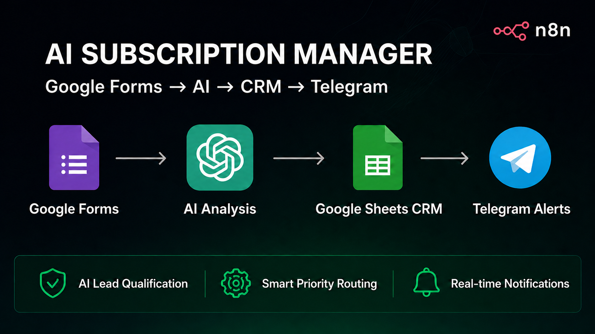
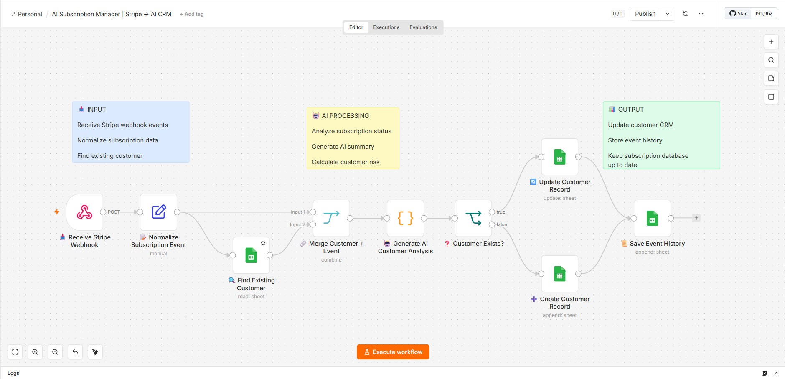
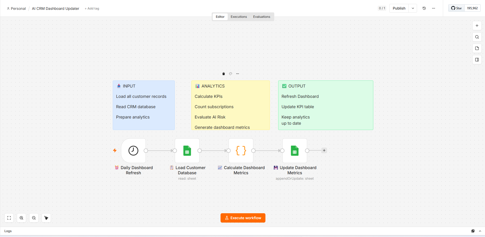
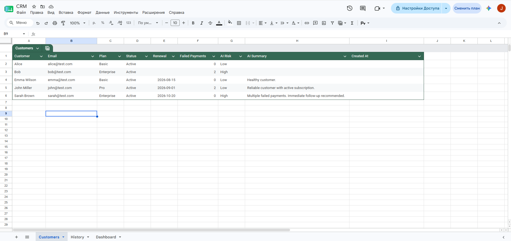
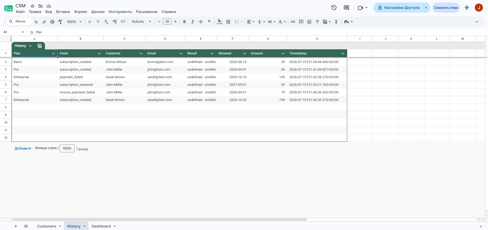
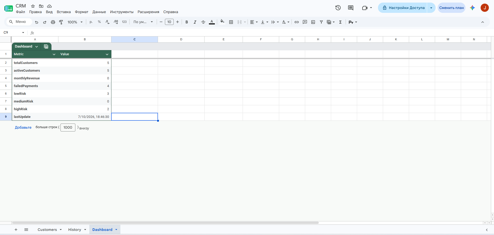

<div align="center">

# 💳 AI Subscription Manager

### AI-Powered Stripe Subscription CRM & Dashboard Automation with n8n



<br>


</div>

---

# 📌 About

**AI Subscription Manager** is an AI-powered subscription management system built with **n8n**.

The workflow automatically receives **Stripe subscription events** through webhooks, analyzes customer subscription health using **OpenAI**, updates a **Google Sheets CRM**, stores every subscription event in a history log, and keeps a live business dashboard with key subscription metrics.

The project demonstrates how AI can automate subscription management, customer monitoring, and reporting without manual intervention.

---

# ✨ Features

- 💳 Stripe Webhook integration
- 🤖 AI-powered subscription analysis
- 👥 Google Sheets customer CRM
- 📝 Automatic subscription history logging
- 📊 Live dashboard metrics
- 🔄 Customer record updates
- ➕ Automatic customer creation
- ⚠️ Subscription risk detection
- ⚡ Fully automated workflow
- 🔧 Easy to customize and extend

---

# 🛠 Tech Stack

| Technology | Purpose |
|------------|---------|
| n8n | Workflow Automation |
| OpenAI API | AI Subscription Analysis |
| Stripe Webhooks | Subscription Events |
| Google Sheets | CRM & Dashboard |

---

# 📊 Workflow

```text
Stripe Webhook
      │
      ▼
Receive Subscription Event
      │
      ▼
Find Customer
      │
      ▼
OpenAI Analysis
      │
      ▼
Customer Exists?
      │
 ┌────┴────┐
 │         │
 ▼         ▼
Update     Create
Customer   Customer
 │         │
 └────┬────┘
      ▼
History Log
      │
      ▼
Dashboard Metrics
```

---

# 📸 Screenshots

## 🤖 Main Subscription Workflow



Receives Stripe webhook events, analyzes subscription health with AI, updates existing customers or creates new records automatically.

---

## 📈 Dashboard Metrics Workflow



Runs on schedule, calculates business metrics from CRM data, and updates the analytics dashboard.

---

## 👥 Customers CRM



Central customer database containing subscription status, renewal dates, AI risk level, failed payments, and AI-generated summaries.

---

## 📝 Subscription History



Stores every Stripe event received, providing a complete subscription activity log.

---

## 📊 Dashboard



Displays automatically calculated KPIs including customer count, subscription health, failed payments, and risk distribution.

---

# 📁 Project Structure

```text
AI-Subscription-Manager-Stripe-AI-CRM/
│
├── Banner.png
├── README.md
│
└── screenshots/
    ├── workflow.png
    ├── dashboard-workflow.png
    ├── customers-sheet.png
    ├── history-sheet.png
    └── dashboard-sheet.png
```

---

# 🚀 Project Overview

This repository showcases an AI-powered subscription management system built with **n8n**, **Stripe**, **OpenAI**, and **Google Sheets**.

The implementation demonstrates:

- Stripe webhook automation
- AI-powered subscription analysis
- Automatic CRM synchronization
- Subscription history tracking
- Dashboard reporting
- End-to-end no-code workflow automation

> **Note:**  
> This repository is intended for **portfolio and educational purposes**. Workflow files, API credentials, and production keys are not included.

---

# 💼 Business Value

- Reduce manual subscription management
- Detect subscription risks automatically
- Maintain an always up-to-date CRM
- Centralize customer history
- Monitor business KPIs automatically
- AI-generated customer insights
- Improve customer retention
- Save hours of repetitive administrative work

---

# 🎯 Use Cases

- Subscription Management
- Stripe Automation
- AI Customer Analysis
- Customer Success Automation
- SaaS CRM
- Dashboard Automation
- Google Sheets CRM
- Business Process Automation

---

# 📄 License

This project is published for educational and portfolio purposes.

---

<div align="center">

### ⭐ If you like this project, give it a star!

</div>
